# **MOMO RADIO**

Radio MOMO is a serverless web radio station using **Golang**, **FFmpeg**, **PostgreSQL**, and **Backblaze B2** (Object Storage).

It features an automated ETL pipeline for music organization, a metadata-rich API, and a "Serverless Edge" streaming engine that pushes HLS segments directly to cloud storage for global distribution via CDN.

## **Architecture**

The system moves from a "Pull" model to a **"Push" model**, treating the Cloud Bucket as the origin server. It now includes a local cache layer to decouple streaming from network latency.

<p align="center">  
  
</p>

## **Setup**

### **1. Prerequisites**

* **Golang** (1.24+)  
* **FFmpeg** (Must be installed on the server running the engine)  
* **PostgreSQL** (15+)  
* **Backblaze B2 Account** (Keys and Bucket access)  
* **Docker & Docker Compose** (Recommended for deployment)

### **2. Infrastructure (Terraform)**

The project use Terraform to provision three specific buckets with lifecycle rules (auto-deletion of old stream segments to save costs).

cd infrastructure  
terraform init  
terraform apply -var-file="dev.tfvars"

This creates:

1. `radio-ingest-raw`: Private bucket for dropping raw files.  
2. `radio-assets-files`: Public bucket acting as your organized library.  
3. `radio-stream-live`: Public bucket where HLS segments are pushed.

### **3. Configuration (config.yaml)**

Create a `config.yaml in the root directory (or mount it in Docker).

```
b2:  
  key_id: "YOUR_B2_KEY_ID"  
  app_key: "YOUR_B2_APP_KEY"  
  endpoint: "[https://s3.us-west-000.backblazeb2.com](https://s3.us-west-000.backblazeb2.com)"  
  region: "us-west-000"  
  bucket_ingest: "radio-ingest-raw"  
  bucket_prod: "radio-assets-files"  
  bucket_stream_live: "radio-stream-live"

server:  
  temp_dir: "./temp_processing"  
  polling_interval_seconds: 10  
  metrics_port: ":9091"

radio:  
  prefetch_count: 5  # Number of tracks to cache ahead of time

database:  
  host: "localhost" # or "postgres" if in docker  
  port: "5432"  
  user: "radio"  
  password: "radiopassword"  
  name: "radio"

services:  
  discogs_token: "YOUR_DISCOGS_TOKEN" # Optional: For finding original labels
```

## **Running with Docker**

The easiest way to run the full stack (Ingester + Streamer + API + Postgres) is via Docker Compose.

# Start all services  
docker-compose -f docker/docker-compose.yml up -d

## **Components**

### **A. The Ingester (Organizer)**

**Role:** Cleans, normalizes, and organizes your music library into Object Storage and PostgreSQL.

* **Usage:** go run cmd/ingest/main.go  
* **Features:**  
  * **ETL Pipeline:** Detects new files in the raw bucket.  
  * **Metadata Enrichment:** Fetches missing tags (Year, Publisher/Label) via **iTunes** and **Discogs** (prioritizing original releases over reissues).  
  * **Normalization:** Volume normalization to **-14 LUFS**.  
  * **Sanitization:** Aggressively strips ID3v2 headers to prevent stream glitches.  
  * **Database:** Indexes all tracks in PostgreSQL for the API.

### **B. The Radio Engine (Broadcaster)**

**Role:** Plays music, transcodes to HLS, and pushes to the edge.

* **Usage:** go run cmd/radio/main.go  
* **Features:**  
  * **Smart DJ:** Randomly picks tracks from music/ and station_id/ prefixes in the database.  
  * **Aggressive Caching:** Implements a **"Download-then-Play"** strategy. It prefetches the next 5 tracks (configurable) to local disk to prevent buffer underruns caused by B2 latency.  
  * **Transcoder:** Pipes audio into FFmpeg to generate .ts segments.  
  * **Race-Free Uploader:** Uploads segments immediately and updates the HLS playlist in real-time.

### **C. The API Server**

**Role:** Provides a JSON interface to query the library and history.

* **Usage:** go run cmd/api/main.go  
* **Port:** :8081  
* **Endpoints:**  
  * GET /health: Health check.  
  * GET /api/v1/tracks?page=1&limit=50&search=Floyd: Search the library.  
  * GET /api/v1/stats: Library statistics.

## **How to Listen**

### **Option 1: Web Player**

Open index.html in your browser.

* *Note: You must update the streamUrl inside index.html to your Cloudflare/Backblaze public URL.*

### **Option 2: VLC (Testing)**

1. Ensure the Radio Engine is running.  
2. Open **VLC Media Player**.  
3. File -> Open Network...  
4. Enter: http://localhost:8080/listen  
5. The local helper will 302 Redirect VLC to the live cloud stream URL.

## **Troubleshooting**

* **FFmpeg Errors ("Header missing" / "Invalid data"):**  
  * This usually means the network connection to B2 dropped while streaming.  
  * **Fix:** The **Prefetcher** handles this automatically by downloading files fully before playing. Ensure radio.prefetch_count is set to at least 3 in config.yaml.  
* **Ingester finds "Independent" label:**  
  * If a track has no label, the Ingester defaults to "Independent".  
  * **Fix:** Add a discogs_token to config.yaml. The system will search Discogs for the oldest release to find the original publisher.  
* **Database Connection Refused:**  
  * Ensure the Postgres container is healthy: docker ps  
  * Check credentials in config.yaml.